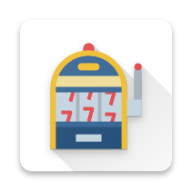

<dl>
    <h1 align="center">
        
        <br><br>Forbes<br>
    </h1>
    <p align="center">
        A casino slot machine simulator for AVR Butterfly
    </p>
    <p align="center">
    	<a href="#requirements-">Requirements 🧬</a> |
        <a href="#build-">Build 🚀</a> |
        <a href="#how-to-use-">How to Play 🕹️</a> |
        <a href="#credits-">Credits ✍</a>
    </p>
    <h1 align="center">
        
    </h1>
</dl>

## Requirements 🧬

* AVR Studio (at least 4.12)
* AVR Butterfly kit or simulator (ATmega169 with LCD display and joystick)

## Build 🚀

1) Create new empty project
2) Add forbes.asm as source file
3) Mark forbes.asm as entry file
4) Assemble project
5) Now you should see chars.inc, print.inc and m169def.inc in included files
6) Run and **enjoy** the game!

## How to Play 🕹️

1) [Build and run](#build-) the game
2) You should see "START" on display
3) Press center button on joystick to start a new game
4) There are three reels. The main task of the game is to stop all three reels with the same picture on it (_Note_: picture on reel is generated "randomly" from list of 0-9 and A-F)
5) Press center button on joystick to stop a reel
6) When one reel stops, the next one starts to spin
7) At the end of the game you should see "WINNER" if all reels have the same picture, otherwise "LOOSER"
8) Wait until your game result blinks and press center button to start a new game

## Credits ✍

#### Related

* Special thanks to [ultimatearm](https://www.flaticon.com/authors/ultimatearm) for app icon!

#### Author

* Ivan Menshikov (menshiva@fit.cvut.cz)

#### License

```
Copyright 2021 Ivan Menshikov

Licensed under the Apache License, Version 2.0 (the "License");
you may not use this file except in compliance with the License.
You may obtain a copy of the License at

   http://www.apache.org/licenses/LICENSE-2.0

Unless required by applicable law or agreed to in writing, software
distributed under the License is distributed on an "AS IS" BASIS,
WITHOUT WARRANTIES OR CONDITIONS OF ANY KIND, either express or implied.
See the License for the specific language governing permissions and
limitations under the License.
```
