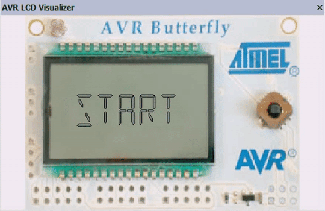

  

# Forbes

A simple casino slot machine game for Atmel AVR Butterfly written in Assembly language.

There are three reels. The main task of the game is to stop all of these reels with the same picture on them (_Note_: picture on a reel is generated "randomly" from 0-9 and A-F).
At the end of the game you'll see "WINNER" if all reels have the same picture or "LOOSER" otherwise.

This project is a final homework of the **Computer Structures and Architectures** course at the [Faculty of Information Technology, CTU in Prague](https://fit.cvut.cz/en).

## Requirements 🧬

* AVR Studio (at least 4.12)
* AVR Butterfly kit or simulator (ATmega169 with LCD display and joystick)

## Build 🚀

1) Create a new empty project
2) Add `forbes.asm` as a source file
3) Mark `forbes.asm` as an entry file
4) Assemble the project
5) Now you should see `chars.inc`, `print.inc` and `m169def.inc` in the folder for included files
6) Run and **enjoy** the game!

## How to Play 🕹️

1) [Build and run](#build-) the game
2) If everything was successful, you should see "START" on the display of your kit
3) Press center button on the joystick to start a new game
4) To stop a spinning reel, press center button
5) When one reel stops, the next one starts to spin
6) After stopping all the three reels either enjoy the victory or accept the defeat
7) Wait until your result stop blinking and press center button to start a new game

## License 📄

Distributed under the WTFPL License. See `LICENSE` for more information.

## Contact ✍

Ivan Menshikov - menshiva@fit.cvut.cz
